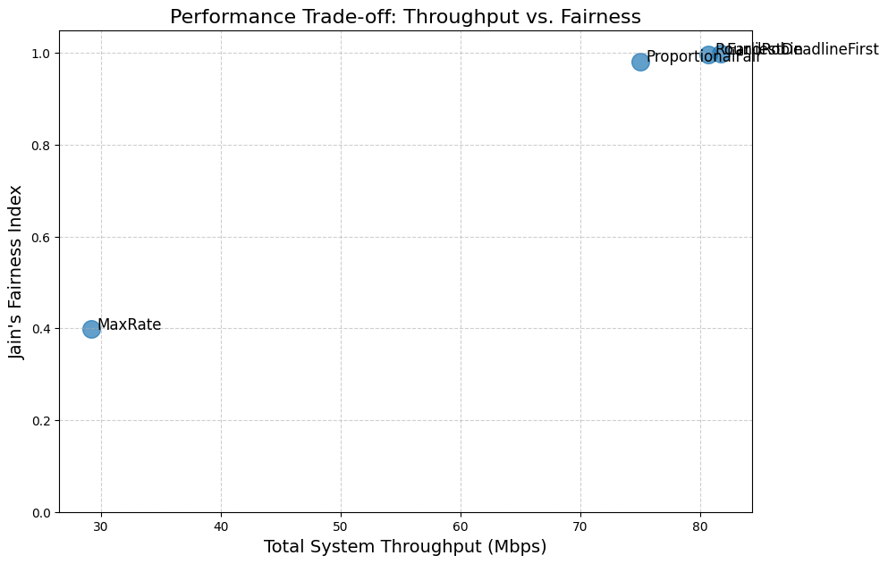
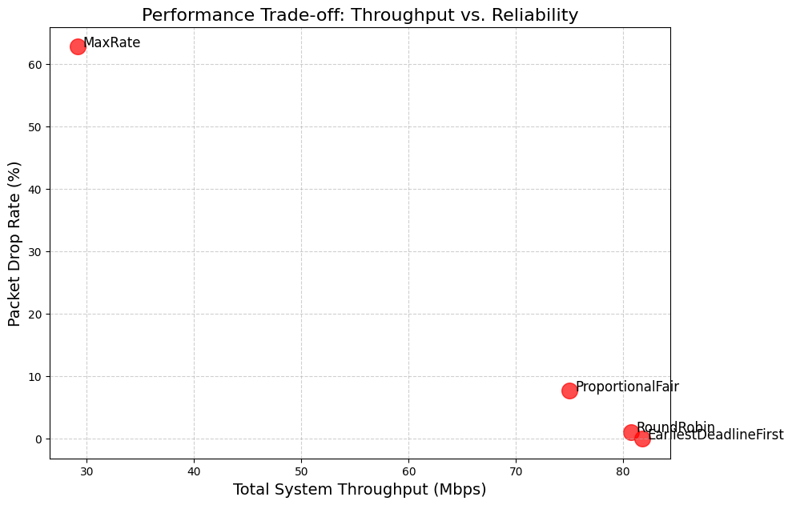
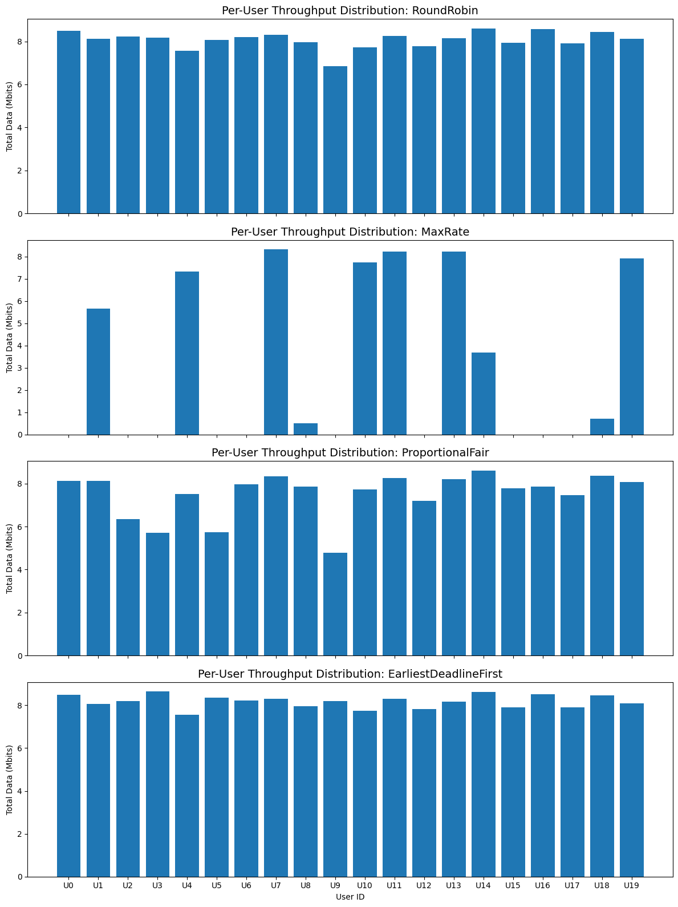
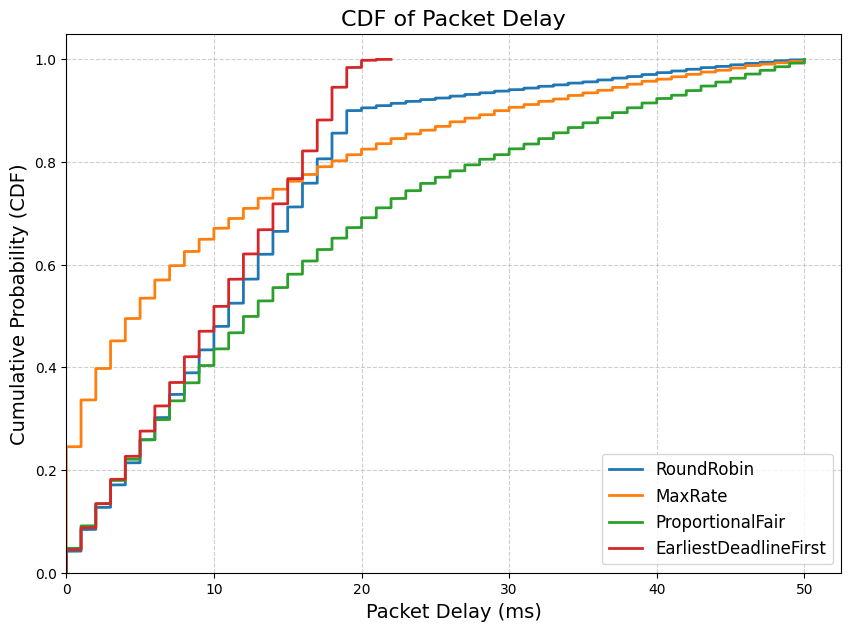

# 5G MAC Layer Scheduler Simulator

This project is a Python-based discrete-event simulator for evaluating MAC-layer scheduling algorithms in a 5G gNodeB.

It simulates a multi-user environment where a base station allocates Resource Blocks (RBs) to various users (UEs) in each Time Transmission Interval (TTI). This simulation models a realistic traffic scenario where packets arrive dynamically (Poisson process) and have strict deadlines, allowing for a deep analysis of time-sensitive scheduling.

## Tech Stack

<div align="center">
  
  
  
</div>

---

## How to Run

1.  **Clone the repository and navigate to the folder:**
    ```bash
    git clone [https://github.com/alborzbm/5GـMACـLayerـSchedulerـSimulator.git](https://github.com/alborzbm/5GـMACـLayerـSchedulerـSimulator.git)
    cd 5GـMACـLayerـSchedulerـSimulator
    ```

2.  **Create and activate a virtual environment:**
    
    *On macOS/Linux:*
    ```bash
    python3 -m venv venv
    source venv/bin/activate
    ```
    *On Windows:*
    ```bash
    python -m venv venv
    .\venv\Scripts\activate
    ```

3.  **Install dependencies:**
    ```bash
    pip install -r requirements.txt
    ```

4.  **Run the simulation:**
    ```bash
    python3 main.py
    ```
    *(Use `python main.py` if `python3` is not available)*

5.  The simulation will run and all output plots will be generated and saved to the `plots/` directory.

---

## Implemented Schedulers

-   **Round Robin (RR):** Fairness-first.
-   **Max-Rate (MR):** Throughput-first (greedy), selects the user with the best *potential* channel rate.
-   **Proportional Fair (PF):** The classic balance between throughput and fairness.
-   **Earliest Deadline First (EDF):** Latency-first, prioritizes packets closest to their expiration deadline.

## Key Performance Indicators (KPIs)

-   **Total System Throughput:** Total data (Mbps) successfully transmitted.
-   **Jain's Fairness Index:** A measure of how fairly resources are distributed (1.0 = perfect fairness).
-   **Average Packet Delay:** The average time a packet waits in the queue before transmission.
-   **Packet Drop Rate (PDR):** The percentage of packets dropped due to exceeding their deadline.

---

## Simulation Results & Analysis

The simulation was run for 20 users over 2000ms with a 50ms packet deadline.

### Quantitative Results

| Scheduler | Total Throughput (Mbps) | Jain's Fairness | Avg. Packet Delay (ms) | Packet Drop Rate (%) |
| :--- | :---: | :---: | :---: | :---: |
| **EarliestDeadlineFirst** | **81.74** | **0.9987** | **9.97** | **0.00 %** |
| RoundRobin | 80.72 | 0.9977 | 12.08 | 1.08 % |
| ProportionalFair | 74.99 | 0.9820 | 16.13 | 7.73 % |
| MaxRate | 29.16 | 0.3981 | 9.83 | 62.76 % |

### Key Findings & Plot Analysis

The results clearly show that in a time-sensitive, deadline-aware environment, **Earliest Deadline First (EDF) is the dominant strategy**, while the classic greedy "MaxRate" algorithm completely fails.

#### 1. The "Money Plot": Throughput vs. Fairness



-   **Analysis:** We see two distinct clusters. **EDF, RR, and PF** are all in the "ideal" top-right corner, achieving both high throughput and near-perfect fairness.
-   **MaxRate** is in the "failure" bottom-left corner. It is not only extremely unfair (Jain's Index < 0.4) but also achieves the lowest system throughput by a large margin.

#### 2. The Real Story: Throughput vs. Reliability (PDR)



-   **Analysis:** This plot explains *why* MaxRate failed. It has a catastrophic **Packet Drop Rate of 62.76%**. It waits for a specific user to have a good channel, while all other users' packets expire in their queues.
-   **EDF** is the clear winner, achieving a **0.00% PDR** while *also* securing the highest throughput. It wastes no resources on packets that are about to be dropped.

#### 3. Per-User Throughput Distribution



-   **Analysis:** This visually confirms the fairness metrics. The top, third, and fourth charts (RR, PF, EDF) show that all 20 users received a comparable amount of data.
-   The **MaxRate** chart clearly shows massive user starvation: 6-7 users received all the data, while the other ~13 users received almost nothing.

#### 4. CDF of Packet Delay



-   **Analysis:** The EDF (red) curve is the best, rising the fastest and earliest, showing that the vast majority of its packets are delivered with the lowest delay.
-   The MaxRate (orange) curve is deceptive: it's fast for the few packets it *does* deliver, but the curve flatlines near 0.4 (40%), visually representing the 60% of packets that were never delivered at all (dropped).

---

## Project Structure

```
5GـMACـLayerـSchedulerـSimulator/
├── .gitignore          # Tells Git which files to ignore (like venv)
├── venv/                 # Virtual environment folder (ignored by Git)
├── plots/                # Output directory for result charts
│   ├── delay_cdf.png
│   ├── throughput_vs_fairness.png
│   ├── throughput_vs_pdr.png
│   └── user_throughput_distribution.png
├── channel.py            # Channel model module (Pathloss, Fading)
├── config.py             # Central configuration file for all parameters
├── main.py               # Main entry point to run the simulation
├── metrics.py            # Calculates KPIs (Throughput, Fairness, Delay, PDR)
├── plotting.py           # Module to generate all plots
├── README.md             # This file
├── requirements.txt      # List of Python dependencies (numpy, matplotlib)
├── schedulers.py         # Module containing all scheduler algorithms
├── simulation.py         # The core simulation engine/loop
└── traffic.py            # Traffic generator and user queue management
```
---

## Author

Alborz Babazadeh  
[LinkedIn](https://www.linkedin.com/in/alborzbabazadeh/) • [GitHub](https://github.com/alborzbm)
